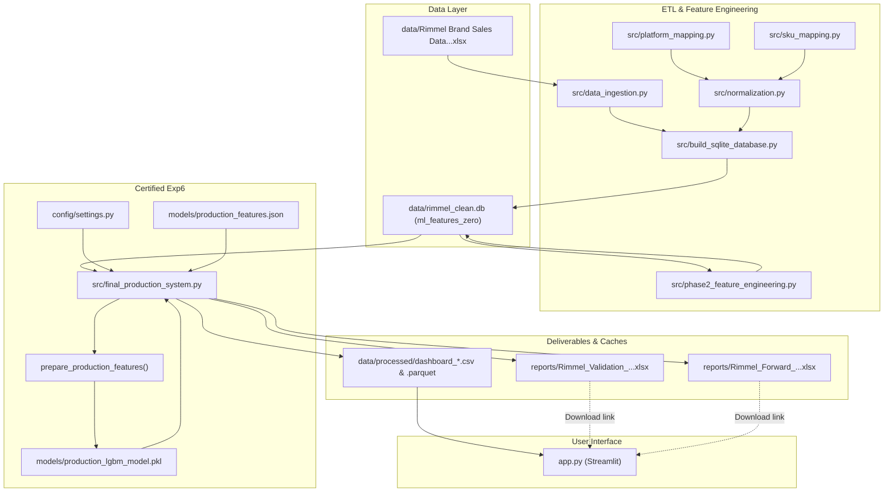

# Complete Codebase Architecture & File Inventory Audit Report

**Auditor:** Senior Software Architect & Codebase Auditor  
**Audit Date:** September 29, 2026  
**Reference System:** Certified Production Exp6 (ZERO Treatment + LightGBM Regressor + Combined Calibration)  
**Repository Working Tree:** Git Branch `main` | Commit `5b7ba23`  
**Audit Constraint:** READ-ONLY AUDIT. Zero files deleted, moved, modified, renamed, committed, or pushed.  

---

## 1. Executive Summary

This comprehensive architectural audit was commissioned to thoroughly inventory, categorize, trace dependencies, evaluate git hygiene, and establish a clean migration plan for the **Rimmel Demand Forecasting & Inventory Planning System**.

The repository has evolved across multiple developmental milestones:
- **Phase 1**: Initial heuristics, data ingestion, 20-SKU pilot, and normalization.
- **Phase 2**: 1-Year historical pattern modeling and 74-feature SQLite schema construction (`ml_features_zero`).
- **Phase 3 – 5**: Controlled experiments comparing treatment strategies (ZERO vs. AVERAGE), 3-tier hybrid architectures, Croston intermittent models, and walk-forward burst evaluations.
- **Exp6 Certification**: Final certified production model (ZERO treatment + LightGBM + combined calibration $\alpha=0.10, \beta=0.10$).
- **Experimental Research**: Standalone ROP (Reorder Point) + TypeSafe Jev experiments (`experiments/rop_xgboost/`).
- **QA & Hardening Phase**: Independent QA audit, correction phase (`DQ-04A`, `DASH-05`), and demand dynamics investigation (`test/demand_forecasting_qa/`).

### High-Level Audit Findings:
1. **Total Repository Footprint**: **1,972 files** totaling **967.3 MB** on disk (excluding `.git` and virtual environment `venv/`).
2. **File Count Composition**:
   - `1,764 files` ($89.5\%$) are individual JSON API response caches in `experiments/rop_xgboost/outputs/jev_cache/`.
   - `87 files` are legacy scripts, test archives, and old SQLite databases in `archive/`.
   - `31 files` belong to the QA audit suite in `test/demand_forecasting_qa/`.
   - `21 files` reside in `src/` (of which only **7 are active in the production pipeline**; the remaining 14 are historical phase runners).
   - `21 files` reside in `data/` (including **195 MB** of obsolete pre-SQLite Excel dumps and a **662.5 MB** SQLite DB).
3. **Active Production Core**: The certified production forecasting system and Streamlit dashboard rely strictly on **16 active files** (1 orchestrator, 5 data modules, 1 config, 3 model artifacts, 1 SQLite database, 1 dashboard script, and 4 precomputed cache sets).
4. **Duplicate Deliverables & Datasets**: Identified 2 exact duplicate Excel report deliverables in `reports/` and multiple redundant raw Excel copies in `data/raw/`.
5. **Git Hygiene & Large Tracked Files**: Over **75 MB** of binary Excel workbooks, a 9.5 MB legacy SQLite database, and a 36.7 MB historical CSV cache are currently tracked in Git history.
6. **No API Secrets Exposed in Git**: Secrets scanning verified that the OpenRouter API key resides solely in `experiments/rop_xgboost/.env` (untracked).

---

## 2. Current Project Structure

The current directory layout is organized into 12 top-level folders plus root files:

```
ml_project/
├── .gitignore                                   # Git ignore rules
├── app.py                                       # Streamlit production dashboard (1,081 lines)
├── requirements.txt                             # Production Python dependencies
├── README.md                                    # Project overview
├── AUDIT_REPORT.md                              # Phase 2 audit documentation (Root)
├── CODEBASE_ARCHITECTURE.md                     # Legacy architectural notes (Root)
├── DEPLOYMENT_CHECKLIST.md                      # Production deployment checklist (Root)
├── FINAL_CODEBASE_AUDIT_REPORT.md               # Pre-Exp6 codebase audit (Root)
├── GIT_MIGRATION_REPORT.md                      # Git cleanup history (Root)
├── PROJECT_COMPLETE_TECHNICAL_AND_BUSINESS_GUIDE.md  # Client comprehensive guide (Root)
├── PROJECT_COMPLETE_TECHNICAL_AND_BUSINESS_GUIDE.pdf # PDF companion guide (Root)
│
├── config/                                      # Configuration settings
│   ├── __init__.py
│   └── settings.py                              # Global constants, paths, Exp6 parameters
│
├── data/                                        # Raw data, SQLite DB, processed caches (922.5 MB)
│   ├── Rimmel Brand Sales Data - 1 Jan 2025 to 10 Sep 2026.xlsx  # Raw source data (7.8 MB)
│   ├── rimmel_clean.db                          # Primary SQLite feature database (662.5 MB)
│   ├── non_existent_fake_db.db                  # 0-byte byproduct from QA failure test
│   ├── raw/                                     # Raw client backups and historical versions (26.9 MB)
│   │   ├── ORIGINAL_COPY.xlsx                   # Duplicate of primary raw data (7.8 MB)
│   │   ├── rimmel_new_sales_data_v2.xlsx        # Historical client ingest (8.0 MB)
│   │   ├── rimmel_old_column_data_v1.xlsx       # Legacy column mapping reference (4.8 MB)
│   │   └── Rimmel_Sales_Data_With_InStock_Flag.xlsx # Historical instock dataset (6.7 MB)
│   └── processed/                               # Dashboard caches and legacy phase dumps (225.7 MB)
│       ├── dashboard_sku_master.csv / .parquet
│       ├── dashboard_validation_sku_daily.csv / .parquet
│       ├── dashboard_validation_sku_summary.csv
│       ├── dashboard_forecast_sku_daily.csv / .parquet
│       ├── dashboard_forecast_sku_summary.csv
│       ├── dashboard_historical_daily.csv (36.7 MB) / .parquet (1.0 MB)
│       ├── rimmel_full_normalized.xlsx          # Obsolete Phase 1.1 normalized dump (15.3 MB)
│       ├── rimmel_ml_ready_normalized.xlsx      # Obsolete Phase 2 intermediate dump (43.3 MB)
│       ├── rimmel_ml_zero_version.xlsx          # Obsolete Phase 3 zero-dataset dump (64.8 MB)
│       └── rimmel_ml_average_version.xlsx       # Obsolete Phase 3 average-dataset dump (69.6 MB)
│
├── documentation/                               # Markdown system manuals (99.5 KB)
│   ├── 01_PROJECT_FORECASTING_REBUILD_DOCUMENTATION.md
│   ├── 02_PROJECT_SUMMARY_AND_APPROACH.md
│   ├── 03_SYSTEM_AUDIT_AND_LIVING_DOCUMENTATION.md
│   ├── 04_INTERNAL_ALGORITHMIC_ARCHITECTURE_AND_PIPELINE_GUIDE.md
│   ├── MASTER_PROJECT_DOCUMENTATION_AND_VERSION_HISTORY.md
│   └── README_DASHBOARD_AND_REPORTS.md
│
├── models/                                      # Serialized production models & feature schema
│   ├── production_lgbm_model.pkl                # Certified Exp6 LightGBM regressor (422 KB)
│   ├── production_features.json                 # Exact 74-feature schema & ordering (5.9 KB)
│   └── production_model_config.json             # Hyperparameters, metrics, training metadata (1.1 KB)
│
├── reports/                                     # Official client deliverables & duplicate exports (233 KB)
│   ├── Rimmel_Validation_Sep01_Sep10_2026.xlsx  # Official 8-sheet validation workbook (48 KB)
│   ├── Rimmel_Forward_Forecast_Sep11_Sep20_2026.xlsx # Official 4-sheet forward forecast (64 KB)
│   ├── validation_report_sep_01_to_10_2026.xlsx # Exact binary duplicate of validation report (48 KB)
│   ├── production_forecast_sep_11_to_20_2026.xlsx # Exact binary duplicate of forward forecast (64 KB)
│   └── Rimmel_Dataset_and_Model_Explanation_Guide.pdf # Client explanation PDF (8.8 KB)
│
├── src/                                         # Core pipeline, ETL, and phase runners (21 files, 483 KB)
│   ├── __init__.py
│   ├── build_sqlite_database.py                 # SQLite database construction ETL (Active)
│   ├── data_ingestion.py                        # Raw Excel ingestion & hashing (Active)
│   ├── normalization.py                         # Transaction normalization & cleaning (Active)
│   ├── platform_mapping.py                      # Multi-channel normalization to 4 platforms (Active)
│   ├── sku_mapping.py                           # Parent-child product hierarchy resolver (Active)
│   ├── phase2_feature_engineering.py            # 74-feature causal feature engine (Active)
│   ├── final_production_system.py               # Certified Exp6 Production Pipeline (Active)
│   ├── data_cleaning.py                         # Legacy Phase 1 anomaly audit
│   ├── observation_engine.py                    # Legacy Phase 1 10-state observation framework
│   ├── reconciliation.py                        # Legacy Phase 1 row/unit reconciliation
│   ├── run_phase1_pipeline.py                   # Legacy Phase 1 orchestrator (broken import)
│   ├── generate_phase2_audit_reports.py         # Phase 2 audit report generator
│   ├── experimental_datasets.py                 # Phase 3 zero vs. average Excel generator
│   ├── phase3_experiment_runner.py              # Phase 3 zero vs. average model runner
│   ├── phase3_1_runner.py                       # Phase 3.1 error analysis runner
│   ├── phase4_walk_forward_runner.py            # Phase 4 4-window walk-forward runner
│   ├── phase5_burst_experiment_runner.py        # Phase 5 high-volume burst experiment
│   ├── final_production_runner.py               # Initial Exp6 training script (superseded)
│   ├── final_production_delivery.py             # Pre-Exp6 delivery script (superseded)
│   └── generate_client_reports.py               # Standalone report generator (superseded)
│
├── tests/                                       # Official regression and leakage test suite (3 files, 16 KB)
│   ├── __init__.py
│   ├── test_feature_leakage.py                  # Temporal boundary and feature leakage unit tests
│   └── test_production_system.py                # Model hyperparameter and report structure unit tests
│
├── test/demand_forecasting_qa/                  # Independent QA audit, correction & edge-case suite (31 files, 376 KB)
│   ├── README.md
│   ├── scripts/                                 # 10 QA test harnesses and master runners
│   └── outputs/                                 # 12 QA audit reports, CSV tables, and summary JSON
│
├── experiments/rop_xgboost/                     # Isolated ROP + Jev research project (1,809 files, 2.36 MB)
│   ├── README.md
│   ├── config.py, rop_target.py, rop_feature_builder.py, baseline_rop_model.py, etc.
│   ├── run_real_jev_phase1.py, run_real_jev_phase2.py, test_jev_openrouter.py
│   ├── REAL_JEV_PHASE1_REPORT.md, REAL_JEV_PHASE2_REPORT.md, ROP_AUDIT_AND_EXPERIMENT_REPORT.md
│   └── outputs/                                 # Metrics, ablations, and 1,764 jev_cache JSONs
│
├── scratch/                                     # Developer scratchpads & temporary files (8 files, 2.15 MB)
│   ├── deep_audit_new_excel.py, extract_detailed_metrics.py, run_diagnosis.py
│   ├── prompt10.txt, prompt10_full.txt, prompt_convert_sqlite.txt, scratch_prompt.txt
│   └── test_speed.xlsx                          # Ad-hoc performance workbook (2.1 MB)
│
└── archive/                                     # Historical versions and obsolete code (87 files, 17.9 MB)
    ├── 31.07.26 to 31.08.26 Detail page sales and traffic*.csv (3 files)
    ├── legacy_tests/test_pipeline.py
    └── previous_versions/                       # 83 historical files across 5 subfolders
        ├── new_approach/                        # Old global forecaster (includes 9.5 MB SQLite DB)
        ├── phase1_heuristics/                   # Rule-based heuristics engine
        ├── root_scripts_legacy/                 # Early export scripts
        ├── scratch_legacy/                      # Early report generators
        └── src_legacy/                          # Legacy 3-tier models
```

---

## 3. Complete File & Folder Inventory

The following master inventory accounts for every distinct file in the project (excluding virtual environment bytecode and the 1,764 individual response caches in `experiments/rop_xgboost/outputs/jev_cache/`):

### 3.1 Root Directory Files
| Relative Path | Type | Size | Purpose & Role | Used By | Prod Dependency | Recommended Action |
| :--- | :---: | :---: | :--- | :--- | :---: | :---: |
| `app.py` | Python | 47.4 KB | Streamlit operational dashboard for demand forecasting, KPIs, and governance. | Streamlit / Users | **YES** | **KEEP** |
| `requirements.txt` | Text | 437 B | Production environment Python package pinning. | pip / Deployment | **YES** | **KEEP** |
| `.gitignore` | Config | 957 B | Git version control exclusions for caches, databases, and logs. | Git | **YES** | **KEEP** |
| `README.md` | Markdown | 12.1 KB | Primary project readme, execution guide, and architecture overview. | Developers / Stakeholders | **YES** | **KEEP** |
| `AUDIT_REPORT.md` | Markdown | 17.6 KB | Historical audit report from early Phase 2 feature inspection. | None (Historical) | **NO** | **ARCHIVE** (to `docs/archive/`) |
| `CODEBASE_ARCHITECTURE.md`| Markdown | 10.2 KB | High-level architectural notes written during Phase 3. | None (Historical) | **NO** | **ARCHIVE** (to `docs/archive/`) |
| `DEPLOYMENT_CHECKLIST.md`| Markdown | 6.4 KB | Step-by-step checklist for production deployment and smoke testing. | DevOps / Deployment | Optional | **KEEP** (move to `docs/`) |
| `FINAL_CODEBASE_AUDIT_REPORT.md` | Markdown | 22.8 KB | Architectural audit conducted prior to Exp6 certification. | None (Historical) | **NO** | **ARCHIVE** (to `docs/archive/`) |
| `GIT_MIGRATION_REPORT.md`| Markdown | 6.4 KB | Audit of git repository history and large binary file tracking. | Developers | **NO** | **ARCHIVE** (to `docs/archive/`) |
| `PROJECT_COMPLETE_TECHNICAL_AND_BUSINESS_GUIDE.md` | Markdown | 129.2 KB | Comprehensive client-facing technical, mathematical, and operational guide. | Client / Stakeholders | Informational | **KEEP** (move to `docs/`) |
| `PROJECT_COMPLETE_TECHNICAL_AND_BUSINESS_GUIDE.pdf` | PDF | 145.6 KB | Formatted PDF export of the client guide. | Client | Informational | **KEEP** (move to `docs/`) |

---

### 3.2 Configuration (`config/`)
| Relative Path | Type | Size | Purpose & Role | Used By | Prod Dependency | Recommended Action |
| :--- | :---: | :---: | :--- | :--- | :---: | :---: |
| `config/__init__.py` | Python | 74 B | Package initialization marker. | Python runtime | **YES** | **KEEP** |
| `config/settings.py` | Python | 3.4 KB | Central source of truth for paths, dates, catalog dimensions, and Exp6 calibration constants ($\alpha=0.10, \beta=0.10$). | `build_sqlite_database.py`, `phase2_feature_engineering.py`, tests | **YES** | **KEEP** |

---

### 3.3 Core Source Code (`src/`)
| Relative Path | Type | Size | Purpose & Role | Used By | Prod Dependency | Recommended Action |
| :--- | :---: | :---: | :--- | :--- | :---: | :---: |
| `src/__init__.py` | Python | 856 B | Package exports for pipeline functions. | Python runtime | **YES** | **KEEP** |
| `src/final_production_system.py` | Python | 60.1 KB | **Certified Exp6 Production Pipeline**: Retrospective holdout validation, full model retraining, forward forecast generation, combined calibration, client report generation, and dashboard cache export. | Operational cron / Users | **YES** | **KEEP** |
| `src/build_sqlite_database.py` | Python | 27.8 KB | ETL pipeline converting raw Excel workbook into normalized SQLite tables (`raw_transactions`, `daily_sku_platform`). | Database generation | **YES** | **KEEP** |
| `src/data_ingestion.py` | Python | 3.0 KB | File hashing, byte-level immutability backup, and raw data ingestion. | `build_sqlite_database.py` | **YES** | **KEEP** |
| `src/normalization.py` | Python | 13.2 KB | Transaction cleaning, platform group assignment, parent SKU mapping, and inventory status assignment. | `build_sqlite_database.py` | **YES** | **KEEP** |
| `src/platform_mapping.py` | Python | 4.2 KB | Normalizes 14 raw sales channels into 4 platform groups (`Amazon`, `eBay`, `Website`, `Other`). | `normalization.py`, `phase2_feature_engineering.py` | **YES** | **KEEP** |
| `src/sku_mapping.py` | Python | 6.4 KB | Resolves parent-child product hierarchy and canonical SKU aliases. | `normalization.py`, `phase2_feature_engineering.py` | **YES** | **KEEP** |
| `src/phase2_feature_engineering.py` | Python | 43.7 KB | Constructs the 74 causal feature matrix and writes `ml_features_zero` in `rimmel_clean.db`. | Feature ETL | **YES** | **KEEP** |
| `src/data_cleaning.py` | Python | 12.0 KB | Legacy Phase 1 data anomaly audit and classification. | `run_phase1_pipeline.py` | **NO** | **ARCHIVE** |
| `src/observation_engine.py` | Python | 6.5 KB | Legacy Phase 1 10-state demand observation matrix. | `run_phase1_pipeline.py` | **NO** | **ARCHIVE** |
| `src/reconciliation.py` | Python | 7.3 KB | Legacy Phase 1 unit and row reconciliation module. | `run_phase1_pipeline.py` | **NO** | **ARCHIVE** |
| `src/run_phase1_pipeline.py` | Python | 7.0 KB | Legacy Phase 1 orchestrator (broken import `src.export_excel`). | None | **NO** | **ARCHIVE** |
| `src/generate_phase2_audit_reports.py` | Python | 22.8 KB | Generates 11 markdown audit reports from Phase 2. | None | **NO** | **ARCHIVE** |
| `src/experimental_datasets.py` | Python | 16.3 KB | Constructs obsolete Excel datasets for zero vs average experiments. | None | **NO** | **ARCHIVE** |
| `src/phase3_experiment_runner.py` | Python | 30.9 KB | Phase 3 model comparison runner (Zero vs Average). | None | **NO** | **ARCHIVE** |
| `src/phase3_1_runner.py` | Python | 50.0 KB | Phase 3.1 error analysis runner across volume tiers. | None | **NO** | **ARCHIVE** |
| `src/phase4_walk_forward_runner.py` | Python | 30.5 KB | Phase 4 4-window walk-forward validation runner. | None | **NO** | **ARCHIVE** |
| `src/phase5_burst_experiment_runner.py` | Python | 21.4 KB | Phase 5 high-volume burst experiment runner. | None | **NO** | **ARCHIVE** |
| `src/final_production_runner.py` | Python | 32.1 KB | Early Exp6 preparation runner; superseded by `final_production_system.py`. | None | **NO** | **ARCHIVE** |
| `src/final_production_delivery.py` | Python | 57.0 KB | Pre-Exp6 delivery pipeline; superseded by `final_production_system.py`. | None | **NO** | **ARCHIVE** |
| `src/generate_client_reports.py` | Python | 30.0 KB | Standalone report generator; superseded by `final_production_system.py`. | None | **NO** | **ARCHIVE** |

---

### 3.4 Data Directory (`data/`)
| Relative Path | Type | Size | Purpose & Role | Used By | Prod Dependency | Recommended Action |
| :--- | :---: | :---: | :--- | :--- | :---: | :---: |
| `data/rimmel_clean.db` | SQLite DB | 662.5 MB | **Primary SQLite Feature Database**: Contains `raw_transactions`, `daily_sku_platform`, and `ml_features_zero` (573,678 rows, 74 features). | `final_production_system.py`, tests | **YES** | **KEEP** (Must NEVER be deleted) |
| `data/Rimmel Brand Sales Data - 1 Jan 2025 to 10 Sep 2026.xlsx` | Excel | 7.5 MB | **Immutable Source Ground Truth**: Raw historical transactions workbook from client. | `build_sqlite_database.py` | **YES** | **KEEP** (Must NEVER be deleted) |
| `data/non_existent_fake_db.db` | File | 0 B | Empty 0-byte file created by SQLite during QA recovery testing (`FAIL-01`). | None | **NO** | **DELETE** |
| `data/raw/ORIGINAL_COPY.xlsx` | Excel | 7.5 MB | Exact byte-level duplicate backup of primary raw data file. | None | **NO** | **ARCHIVE** |
| `data/raw/rimmel_new_sales_data_v2.xlsx` | Excel | 8.0 MB | Historical client ingest delivered during Phase 2. | Legacy scripts | **NO** | **ARCHIVE** |
| `data/raw/rimmel_old_column_data_v1.xlsx` | Excel | 4.8 MB | Historical raw client export delivered during Phase 1. | Legacy scripts | **NO** | **ARCHIVE** |
| `data/raw/Rimmel_Sales_Data_With_InStock_Flag.xlsx` | Excel | 6.7 MB | Historical intermediate file with manual instock flags. | Legacy scripts | **NO** | **ARCHIVE** |
| `data/processed/dashboard_sku_master.csv / .parquet` | Data | 131 KB / 31 KB | Precomputed catalog SKU metadata and platform associations. | `app.py`, regression tests | **YES** | **KEEP** |
| `data/processed/dashboard_validation_sku_daily.csv / .parquet` | Data | 849 KB / 25 KB | Precomputed retrospective validation daily series (Sep 01–10). | `app.py`, regression tests | **YES** | **KEEP** |
| `data/processed/dashboard_validation_sku_summary.csv` | Data | 107 KB | Precomputed retrospective validation SKU-level 10-day aggregates. | `app.py` | **YES** | **KEEP** |
| `data/processed/dashboard_forecast_sku_daily.csv / .parquet` | Data | 815 KB / 18 KB | Precomputed forward forecast daily series (Sep 11–20). | `app.py`, regression tests | **YES** | **KEEP** |
| `data/processed/dashboard_forecast_sku_summary.csv` | Data | 110 KB | Precomputed forward forecast SKU-level 10-day aggregates. | `app.py` | **YES** | **KEEP** |
| `data/processed/dashboard_historical_daily.csv / .parquet` | Data | 36.7 MB / 1.0 MB | Historical daily platform sales and stock time-series (Aug 2025–Sep 2026). | `app.py` | **YES** | **KEEP** (Migrate `app.py` to Parquet) |
| `data/processed/rimmel_full_normalized.xlsx` | Excel | 15.3 MB | Obsolete Phase 1.1 normalized Excel dump. | None | **NO** | **DELETE** (superseded by SQLite DB) |
| `data/processed/rimmel_ml_ready_normalized.xlsx` | Excel | 43.3 MB | Obsolete Phase 2 normalized Excel dump. | None | **NO** | **DELETE** (superseded by SQLite DB) |
| `data/processed/rimmel_ml_zero_version.xlsx` | Excel | 64.8 MB | Obsolete Phase 3 zero-treatment feature dump. | None | **NO** | **DELETE** (superseded by SQLite DB) |
| `data/processed/rimmel_ml_average_version.xlsx` | Excel | 69.6 MB | Obsolete Phase 3 average-treatment feature dump. | None | **NO** | **DELETE** (superseded by SQLite DB) |

---

### 3.5 Models Directory (`models/`)
| Relative Path | Type | Size | Purpose & Role | Used By | Prod Dependency | Recommended Action |
| :--- | :---: | :---: | :--- | :--- | :---: | :---: |
| `models/production_lgbm_model.pkl` | Pickle | 422 KB | **Certified Exp6 Model Artifact**: Serialized LightGBM Regressor (150 trees, depth 6, seed 42). SHA256: `821ba6ac...`. | Model inference, tests | **YES** | **KEEP** (Must NEVER be deleted) |
| `models/production_features.json` | JSON | 5.9 KB | **Production Feature Schema**: List and order of all 74 features + 8 categorical feature definitions. SHA256: `824411eb...`. | Model inference, preprocessor, tests | **YES** | **KEEP** (Must NEVER be deleted) |
| `models/production_model_config.json` | JSON | 1.1 KB | Metadata detailing model version, hyperparameters, training dates, and calibration parameters. | Production pipeline, tests | **YES** | **KEEP** |

---

### 3.6 Reports Directory (`reports/`)
| Relative Path | Type | Size | Purpose & Role | Used By | Prod Dependency | Recommended Action |
| :--- | :---: | :---: | :--- | :--- | :---: | :---: |
| `reports/Rimmel_Validation_Sep01_Sep10_2026.xlsx` | Excel | 48.1 KB | **Certified Validation Deliverable**: 8-sheet client validation report. | Client deliverables, `app.py` download | **YES** | **KEEP** |
| `reports/Rimmel_Forward_Forecast_Sep11_Sep20_2026.xlsx` | Excel | 64.3 KB | **Certified Forward Forecast Deliverable**: 4-sheet client forward forecast workbook. | Client deliverables, `app.py` download | **YES** | **KEEP** |
| `reports/validation_report_sep_01_to_10_2026.xlsx` | Excel | 48.1 KB | **Exact Binary Duplicate** of `Rimmel_Validation_Sep01_Sep10_2026.xlsx` (same SHA256). | None (Fallback alias) | **NO** | **ARCHIVE** / **DELETE** |
| `reports/production_forecast_sep_11_to_20_2026.xlsx` | Excel | 64.3 KB | **Exact Binary Duplicate** of `Rimmel_Forward_Forecast_Sep11_Sep20_2026.xlsx` (same SHA256). | None (Fallback alias) | **NO** | **ARCHIVE** / **DELETE** |
| `reports/Rimmel_Dataset_and_Model_Explanation_Guide.pdf` | PDF | 8.8 KB | Client PDF overview explaining data features, calibration, and platform rules. | Client deliverables | Informational | **KEEP** |

---

### 3.7 Documentation (`documentation/`)
| Relative Path | Type | Size | Purpose & Role | Recommended Action |
| :--- | :---: | :---: | :--- | :---: |
| `documentation/01_PROJECT_FORECASTING_REBUILD_DOCUMENTATION.md` | Markdown | 9.4 KB | Initial project rebuild architecture plan. | **KEEP** (Consolidate into `docs/`) |
| `documentation/02_PROJECT_SUMMARY_AND_APPROACH.md` | Markdown | 3.6 KB | High-level summary of the forecasting rebuild methodology. | **KEEP** (Consolidate into `docs/`) |
| `documentation/03_SYSTEM_AUDIT_AND_LIVING_DOCUMENTATION.md` | Markdown | 8.1 KB | System living documentation and maintenance guidelines. | **KEEP** (Consolidate into `docs/`) |
| `documentation/04_INTERNAL_ALGORITHMIC_ARCHITECTURE_AND_PIPELINE_GUIDE.md` | Markdown | 37.3 KB | Detailed mathematical and algorithmic pipeline guide. | **KEEP** (Consolidate into `docs/`) |
| `documentation/MASTER_PROJECT_DOCUMENTATION_AND_VERSION_HISTORY.md` | Markdown | 36.3 KB | Master chronological log across Phases 1 through Exp6. | **KEEP** (Consolidate into `docs/`) |
| `documentation/README_DASHBOARD_AND_REPORTS.md` | Markdown | 4.8 KB | User guide for operating the Streamlit dashboard. | **KEEP** (Consolidate into `docs/`) |

---

### 3.8 Official Tests (`tests/`)
| Relative Path | Type | Size | Purpose & Role | Used By | Prod Dependency | Recommended Action |
| :--- | :---: | :---: | :--- | :--- | :---: | :---: |
| `tests/__init__.py` | Python | 41 B | Package marker for test discovery. | unittest / pytest | **YES** | **KEEP** |
| `tests/test_production_system.py` | Python | 11.5 KB | **Core Production Unit Suite**: 12 tests validating model hyperparameters, 74-feature schema, report structure, and shared warehouse inventory integrity. | CI / Pre-deploy checks | **YES** | **KEEP** |
| `tests/test_feature_leakage.py` | Python | 4.6 KB | **Temporal Leakage Unit Suite**: Verifies temporal causal boundaries ($t < T$) and non-leaking platform features. | CI / Pre-deploy checks | **YES** | **KEEP** |

---

### 3.9 QA Audit Suite (`test/demand_forecasting_qa/`)
| Relative Path | Type | Size | Purpose & Role | Prod Dependency | Recommended Action |
| :--- | :---: | :---: | :--- | :---: | :---: |
| `test/demand_forecasting_qa/README.md` | Markdown | 5.5 KB | QA suite documentation and test case dictionary. | **NO** | **ARCHIVE** (Preserve evidence) |
| `test/demand_forecasting_qa/scripts/run_all_qa_tests.py` | Python | 22.9 KB | Master test runner executing all 63 QA tests across 7 test suites. | **NO** | **ARCHIVE** (Preserve harness) |
| `test/demand_forecasting_qa/scripts/run_focused_regression_tests.py` | Python | 11.8 KB | Regression test runner verifying fixes for `DQ-04A` and `DASH-05`. | **NO** | **ARCHIVE** (Preserve harness) |
| `test/demand_forecasting_qa/scripts/qa_harness.py` | Python | 3.9 KB | Common test recorder and assertion harness. | **NO** | **ARCHIVE** (Preserve harness) |
| `test/demand_forecasting_qa/scripts/test_data_quality.py` | Python | 24.7 KB | Data quality tests (nulls, types, primary keys, partitions). | **NO** | **ARCHIVE** (Preserve harness) |
| `test/demand_forecasting_qa/scripts/test_demand_dynamics.py` | Python | 12.0 KB | 18 demand archetypes evaluation script. | **NO** | **ARCHIVE** (Preserve harness) |
| `test/demand_forecasting_qa/scripts/test_inventory_and_platforms.py` | Python | 18.1 KB | Inventory stockout dampening and channel isolation tests. | **NO** | **ARCHIVE** (Preserve harness) |
| `test/demand_forecasting_qa/scripts/test_features_and_leakage.py` | Python | 14.2 KB | 74-feature schema and future transaction injection tests. | **NO** | **ARCHIVE** (Preserve harness) |
| `test/demand_forecasting_qa/scripts/test_calibration_and_aggregation.py` | Python | 11.5 KB | Calibration boundary tests (Conditions A–I) and 10-day sum. | **NO** | **ARCHIVE** (Preserve harness) |
| `test/demand_forecasting_qa/scripts/test_reporting_and_dashboard.py` | Python | 17.5 KB | Report format verification and dashboard loader tests. | **NO** | **ARCHIVE** (Preserve harness) |
| `test/demand_forecasting_qa/scripts/test_system_recovery_and_scale.py` | Python | 11.9 KB | Reproducibility, failure recovery, and 10k SKU scaling tests. | **NO** | **ARCHIVE** (Preserve harness) |
| `test/demand_forecasting_qa/outputs/DEMAND_FORECASTING_QA_REPORT.md` | Markdown | 24.1 KB | **Official Master QA Audit Report** (Updated 55 PASS, 0 FAIL). | **NO** | **KEEP** (Move to `docs/qa/`) |
| `test/demand_forecasting_qa/outputs/QA_CORRECTION_REPORT.md` | Markdown | 18.2 KB | **Official QA Correction Report** documenting DQ-04A & DASH-05 fixes. | **NO** | **KEEP** (Move to `docs/qa/`) |
| `test/demand_forecasting_qa/outputs/DEMAND_WARNING_INVESTIGATION_REPORT.md`| Markdown | 24.5 KB | **Official 7-Warning Empirical Investigation Report**. | **NO** | **KEEP** (Move to `docs/qa/`) |
| `test/demand_forecasting_qa/outputs/DEMAND_FORECASTING_QA_REPORT_ORIGINAL.md`| Markdown | 25.2 KB | Baseline QA report prior to corrections. | **NO** | **ARCHIVE** (Preserve evidence) |
| `test/demand_forecasting_qa/outputs/qa_summary.json` | JSON | 399 B | Machine-readable test verdict summary. | **NO** | **KEEP** (Move to `docs/qa/`) |
| `test/demand_forecasting_qa/outputs/qa_test_results.csv` | CSV | 19.5 KB | 63-test detailed results table. | **NO** | **KEEP** (Move to `docs/qa/`) |
| `test/demand_forecasting_qa/outputs/demand_warning_real_analogues.csv` | CSV | 3.9 KB | Real Rimmel SKU analogues for the 7 warnings. | **NO** | **KEEP** (Move to `docs/qa/`) |
| `test/demand_forecasting_qa/outputs/edge_case_predictions.csv` | CSV | 2.3 KB | Predictions across all 18 synthetic demand archetypes. | **NO** | **ARCHIVE** |
| `test/demand_forecasting_qa/outputs/feature_audit.csv` | CSV | 4.3 KB | Causal statistics across all 74 features. | **NO** | **ARCHIVE** |
| `test/demand_forecasting_qa/outputs/dashboard_qa_results.md` | Markdown | 1.2 KB | Detailed dashboard test findings. | **NO** | **ARCHIVE** |
| `test/demand_forecasting_qa/outputs/leakage_test_results.csv` | CSV | 390 B | Temporal future injection test results. | **NO** | **ARCHIVE** |
| `test/demand_forecasting_qa/outputs/reporting_audit.csv` | CSV | 333 B | Workbook sheet verification audit. | **NO** | **ARCHIVE** |

---

### 3.10 Research Experiments (`experiments/rop_xgboost/`)
| Relative Path | Type | Size | Purpose & Role | Recommended Action |
| :--- | :---: | :---: | :--- | :---: |
| `experiments/rop_xgboost/README.md` | Markdown | 3.4 KB | Overview of Tosif's ROP + Jev architecture experiment. | **KEEP IN EXPERIMENTS** |
| `experiments/rop_xgboost/config.py` | Python | 2.1 KB | Configuration for the ROP XGBoost experiment. | **KEEP IN EXPERIMENTS** |
| `experiments/rop_xgboost/rop_target.py` | Python | 4.2 KB | Target computation for lead-time demand and reorder points. | **KEEP IN EXPERIMENTS** |
| `experiments/rop_xgboost/rop_feature_builder.py` | Python | 6.8 KB | Feature extractor building structured inputs for ROP model. | **KEEP IN EXPERIMENTS** |
| `experiments/rop_xgboost/baseline_rop_model.py` | Python | 3.1 KB | Pure XGBoost baseline model without Jev. | **KEEP IN EXPERIMENTS** |
| `experiments/rop_xgboost/jev_adapter.py` | Python | 6.5 KB | Abstract interface for deterministic Jev provider. | **KEEP IN EXPERIMENTS** |
| `experiments/rop_xgboost/jev_enhanced_rop_model.py` | Python | 3.1 KB | XGBoost model incorporating Jev decision features. | **KEEP IN EXPERIMENTS** |
| `experiments/rop_xgboost/jev_cache.py` | Python | 2.7 KB | File-based caching layer for OpenRouter Jev calls. | **KEEP IN EXPERIMENTS** |
| `experiments/rop_xgboost/real_jev_adapter.py` | Python | 8.0 KB | HTTP client for OpenRouter `~typesafe/jev-latest` endpoint. | **KEEP IN EXPERIMENTS** |
| `experiments/rop_xgboost/test_jev_openrouter.py` | Python | 7.4 KB | Connectivity and contract test for OpenRouter Jev API. | **KEEP IN EXPERIMENTS** |
| `experiments/rop_xgboost/run_real_jev_phase1.py` | Python | 18.1 KB | Phase 1 real Jev experiment runner. | **KEEP IN EXPERIMENTS** |
| `experiments/rop_xgboost/run_real_jev_phase2.py` | Python | 31.5 KB | Phase 2 full evaluation runner for Jev incremental value. | **KEEP IN EXPERIMENTS** |
| `experiments/rop_xgboost/walk_forward_backtest.py` | Python | 6.9 KB | Walk-forward simulation engine for inventory service levels. | **KEEP IN EXPERIMENTS** |
| `experiments/rop_xgboost/run_experiment.py` | Python | 8.7 KB | Orchestrator comparing baseline vs. Jev-enhanced ROP. | **KEEP IN EXPERIMENTS** |
| `experiments/rop_xgboost/check_sample.py` | Python | 3.6 KB | Diagnostic script inspecting ROP features. | **KEEP IN EXPERIMENTS** |
| `experiments/rop_xgboost/requirements.txt` | Text | 110 B | Experiment-specific package requirements (`xgboost`, etc.). | **KEEP IN EXPERIMENTS** |
| `experiments/rop_xgboost/.env` | Config | 92 B | OpenRouter API Key configuration (untracked). | **KEEP IN EXPERIMENTS** |
| `experiments/rop_xgboost/REAL_JEV_PHASE1_REPORT.md` | Markdown | 18.2 KB | Phase 1 OpenRouter Jev connectivity & data report. | **KEEP IN EXPERIMENTS** |
| `experiments/rop_xgboost/REAL_JEV_PHASE2_REPORT.md` | Markdown | 27.3 KB | Phase 2 Jev + XGBoost incremental value experiment report. | **KEEP IN EXPERIMENTS** |
| `experiments/rop_xgboost/ROP_AUDIT_AND_EXPERIMENT_REPORT.md`| Markdown | 18.7 KB | Comprehensive ROP research architecture report. | **KEEP IN EXPERIMENTS** |
| `experiments/rop_xgboost/outputs/*` | CSV/JSON | ~400 KB | Output metrics, predictions, and ablations. | **KEEP IN EXPERIMENTS** |
| `experiments/rop_xgboost/outputs/jev_cache/` | Directory | ~1.7 MB | 1,764 individual cached OpenRouter response JSON files. | **KEEP IN EXPERIMENTS** |

---

### 3.11 Developer Scratch Directory (`scratch/`)
| Relative Path | Type | Size | Purpose & Role | Recommended Action |
| :--- | :---: | :---: | :--- | :---: |
| `scratch/deep_audit_new_excel.py` | Python | 10.2 KB | Ad-hoc script from early Excel structure audit. | **ARCHIVE** (or **DELETE**) |
| `scratch/extract_detailed_metrics.py` | Python | 6.2 KB | Ad-hoc metric calculation script. | **ARCHIVE** (or **DELETE**) |
| `scratch/run_diagnosis.py` | Python | 8.6 KB | Ad-hoc SKU diagnostic script. | **ARCHIVE** (or **DELETE**) |
| `scratch/test_speed.xlsx` | Excel | 2.1 MB | Temporary performance test spreadsheet. | **DELETE** |
| `scratch/prompt10.txt` | Text | 4.2 KB | Raw prompt backup from prior prompt. | **DELETE** |
| `scratch/prompt10_full.txt` | Text | 6.8 KB | Raw prompt backup from prior prompt. | **DELETE** |
| `scratch/prompt_convert_sqlite.txt` | Text | 6.5 KB | Raw prompt backup from SQLite conversion phase. | **DELETE** |
| `scratch/scratch_prompt.txt` | Text | 17.9 KB | Raw prompt backup. | **DELETE** |

---

### 3.12 Historical Archive Directory (`archive/`)
The `archive/` folder contains **87 files** totaling **17.87 MB** preserved from earlier versions:
- `archive/previous_versions/new_approach/` (30 files, 10.3 MB): Contains early standalone scripts, previous app version, and old SQLite database `sales_forecasting.db` (9.5 MB).
- `archive/previous_versions/phase1_heuristics/` (13 files, 137 KB): Early rule-based forecasting scripts (`baseline_forecast.py`, `momentum_forecast.py`, etc.).
- `archive/previous_versions/src_legacy/` (11 files, 150 KB): Early 3-tier models and SQL data processing scripts.
- `archive/previous_versions/scratch_legacy/` (4 files, 40 KB): Ad-hoc report generators.
- `archive/previous_versions/root_scripts_legacy/` (3 files, 6.7 MB): Legacy report scripts and duplicate instock Excel file.
- `archive/legacy_tests/test_pipeline.py` (4.4 KB): Obsolete test.
- `archive/31.07.26 to 31.08.26 Detail page sales and traffic*.csv` (3 files, 1.28 MB): Ad-hoc Amazon sales traffic exports.
- **Recommended Action for `archive/`**: **KEEP AS IS** (or consolidate into a single compressed cold-storage tarball).

---

## 4. Production-Critical Files (Must NEVER Be Deleted)

The certified production forecasting system has strict dependencies on the following **16 core artifacts**:

```
====================================================================================================
CATEGORY               RELATIVE PATH                                  SIZE      ROLE IN PRODUCTION
====================================================================================================
Pipeline Engine        src/final_production_system.py                 60.1 KB   Certified Exp6 Orchestrator
Database ETL           src/build_sqlite_database.py                   27.8 KB   Rebuilds SQLite DB from raw
ETL Component          src/data_ingestion.py                           3.0 KB   Ingests raw client data
ETL Component          src/normalization.py                           13.2 KB   Cleans & maps transactions
ETL Component          src/platform_mapping.py                         4.2 KB   Maps channels to 4 platforms
ETL Component          src/sku_mapping.py                              6.4 KB   Resolves product hierarchy
Feature Engine         src/phase2_feature_engineering.py              43.7 KB   Builds 74 causal features
Configuration          config/settings.py                              3.4 KB   Global paths, params, alpha/beta
Production Model       models/production_lgbm_model.pkl              422.3 KB   Certified LightGBM regressor
Feature Schema         models/production_features.json                 5.9 KB   Exact 74-feature ordering
Model Metadata         models/production_model_config.json             1.1 KB   Hyperparameters & config
Production Database    data/rimmel_clean.db                          662.5 MB   Live 74-feature database
Source Ground Truth    data/Rimmel Brand Sales Data - ... .xlsx        7.5 MB   Immutable client sales data
Operational UI         app.py                                         47.4 KB   Streamlit operational UI
Validation Deliverable reports/Rimmel_Validation_Sep01_Sep10_2026.xlsx 48.1 KB  Certified validation report
Forecast Deliverable   reports/Rimmel_Forward_Forecast_Sep11_...xlsx   64.3 KB  Certified forward forecast
====================================================================================================
```

> [!IMPORTANT]
> **Production Safety Invariant**: Deleting or modifying any of the 16 files listed above will break automated forecasting, invalidate client deliverables, corrupt database generation, or prevent the Streamlit dashboard from launching.

---

## 5. Production Runtime Dependency Map

The following Mermaid diagram traces the exact dataflow and execution paths of the active production system:



---

## 6. Dashboard Dependencies (`app.py`)

A rigorous static analysis of `app.py` confirms the following runtime operational dependencies:

### Data Ingestion in `app.py`:
1. **Primary Caches Loaded via `load_data_caches()`** (lines 120–162):
   - `data/processed/dashboard_sku_master.csv`: Ingests catalog dimensions (674 SKUs, platform coverage, categories).
   - `data/processed/dashboard_validation_sku_daily.csv`: Daily platform actuals vs. predictions for retrospective validation (Sep 01–10).
   - `data/processed/dashboard_forecast_sku_daily.csv`: Daily forward forecasts per platform (Sep 11–20).
   - `data/processed/dashboard_historical_daily.csv`: Historical daily time-series (Aug 2025–Sep 2026).
   - `reports/validation_metrics.csv`: Optional summary metrics (falls back gracefully if absent).
2. **Early Integrity Guard** (lines 164–184):
   - If any of `sku_master`, `val_daily`, `fwd_daily`, or `hist_daily` are empty, `st.error()` halts execution via `st.stop()`.
3. **Report Download Handlers**:
   - `reports/Rimmel_Forward_Forecast_Sep11_Sep20_2026.xlsx` (fallback: `reports/production_forecast_sep_11_to_20_2026.xlsx`).
   - `reports/Rimmel_Validation_Sep01_Sep10_2026.xlsx` (fallback: `reports/validation_report_sep_01_to_10_2026.xlsx`).

> [!NOTE]
> `app.py` **never loads** `models/production_lgbm_model.pkl` or connects directly to SQLite at runtime. It operates as an ultra-fast, decoupled operational presentation layer reading precomputed artifacts generated by `src/final_production_system.py`.

---

## 7. Experiment & Research Files (`experiments/rop_xgboost/`)

The directory `experiments/rop_xgboost/` represents Tosif's proposed architecture evaluating whether **TypeSafe Jev** provides measurable incremental value when added to a structured-data XGBoost ROP model:
- **Status:** **Active Research Experiment** (Completed Phase 1 and Phase 2).
- **Independence:** Completely isolated from the demand forecasting system. Zero imports between `experiments/` and `src/` or `app.py`.
- **Files Contained:**
  - 14 Python scripts implementing feature building, baseline XGBoost, Jev adapters, OpenRouter clients, and backtesting.
  - 3 comprehensive markdown research reports:
    - `REAL_JEV_PHASE1_REPORT.md`: Connectivity, schema contract, and zero-leakage verification.
    - `REAL_JEV_PHASE2_REPORT.md`: Primary incremental-value experiment findings across 140 evaluation cases.
    - `ROP_AUDIT_AND_EXPERIMENT_REPORT.md`: Complete theoretical and architectural blueprint.
  - 1,764 individual response JSON files in `outputs/jev_cache/` caching OpenRouter API calls to eliminate unnecessary token costs during repeated evaluations.
- **Safety Directive:** **Do NOT delete.** Must remain preserved in `experiments/` as isolated historical research.

---

## 8. Legacy & Deprecated Files in `src/`

14 of the 21 Python files in `src/` are obsolete phase runners or superseded delivery scripts that are no longer executed:

| File Name | Size | Original Phase | Reason for Deprecation |
| :--- | :---: | :---: | :--- |
| `src/run_phase1_pipeline.py` | 7.0 KB | Phase 1 | Contains broken import `from src.export_excel import export_to_excel` (module removed in Phase 2). |
| `src/data_cleaning.py` | 12.0 KB | Phase 1 | Data quality auditing logic was formalized into `src/normalization.py`. |
| `src/observation_engine.py` | 6.5 KB | Phase 1 | Observation classification was formalized into `src/normalization.py`. |
| `src/reconciliation.py` | 7.3 KB | Phase 1 | One-off reconciliation script from the initial data audit. |
| `src/generate_phase2_audit_reports.py`| 22.8 KB | Phase 2 | Produced 11 markdown audit reports specific to the Phase 2 feature freeze. |
| `src/experimental_datasets.py` | 16.3 KB | Phase 3 | Generated large Excel datasets for the zero vs. average experiment. |
| `src/phase3_experiment_runner.py` | 30.9 KB | Phase 3 | Experiment runner comparing ZERO vs. AVERAGE treatments. |
| `src/phase3_1_runner.py` | 50.0 KB | Phase 3.1 | Evaluated error distributions across volume tiers. |
| `src/phase4_walk_forward_runner.py` | 30.5 KB | Phase 4 | Evaluated 4-window walk-forward stability. |
| `src/phase5_burst_experiment_runner.py`| 21.4 KB| Phase 5 | Evaluated high-volume burst predictability. |
| `src/final_production_runner.py` | 32.1 KB | Pre-Exp6 | Initial preparation script; superseded by `final_production_system.py`. |
| `src/final_production_delivery.py` | 57.0 KB | Pre-Exp6 | Previous monolithic pipeline; superseded by `final_production_system.py`. |
| `src/generate_client_reports.py` | 30.0 KB | Pre-Exp6 | Standalone report generator; styling logic integrated into `final_production_system.py`. |

---

## 9. QA Audit Files (`test/demand_forecasting_qa/`)

The directory `test/demand_forecasting_qa/` was created during the comprehensive external QA audit:
- **Contents:**
  - 10 QA test harness scripts in `scripts/`.
  - 12 QA reports, test result tables, and CSV outputs in `outputs/`.
- **Production Status:** Independent test harness. Production and dashboard do not import anything from this directory.
- **Evidence Value:** Highly valuable compliance and audit artifacts:
  - `DEMAND_FORECASTING_QA_REPORT.md`: Full 63-test audit documentation.
  - `QA_CORRECTION_REPORT.md`: Formal technical record of `DQ-04A` and `DASH-05` fixes.
  - `DEMAND_WARNING_INVESTIGATION_REPORT.md`: Empirical catalog evidence demonstrating that the 7 synthetic warnings represent zero production defects.
- **Recommendation:** Do not delete. In the clean target structure, move the reports to `docs/qa/` and archive the test scripts under `archive/qa_test_harness/`.

---

## 10. Duplicate & Redundant Files

| File A | File B | Size | Relationship / Evidence | Recommendation |
| :--- | :--- | :---: | :--- | :---: |
| `reports/Rimmel_Validation_Sep01_Sep10_2026.xlsx` | `reports/validation_report_sep_01_to_10_2026.xlsx` | 48.1 KB | **100% Bitwise Identical** (SHA256: `f0a7bae9...`). | Remove redundant snake_case duplicate. |
| `reports/Rimmel_Forward_Forecast_Sep11_Sep20_2026.xlsx` | `reports/production_forecast_sep_11_to_20_2026.xlsx` | 64.3 KB | **100% Bitwise Identical** (SHA256: `c94eed23...`). | Remove redundant snake_case duplicate. |
| `data/Rimmel Brand Sales Data - 1 Jan 2025 to 10 Sep 2026.xlsx` | `data/raw/ORIGINAL_COPY.xlsx` | 7.5 MB | Near-identical raw transaction backup (7,841,989 vs. 7,841,949 bytes). | Move `ORIGINAL_COPY.xlsx` to cold storage. |
| `data/raw/Rimmel_Sales_Data_With_InStock_Flag.xlsx` | `archive/previous_versions/root_scripts_legacy/Rimmel_Sales_Data_With_InStock_Flag.xlsx` | 6.7 MB | Near-identical legacy file with instock flags (6,983,111 vs. 6,983,110 bytes). | Keep archive copy; remove `data/raw/` copy. |
| `data/processed/dashboard_historical_daily.csv` | `data/processed/dashboard_historical_daily.parquet` | 36.7 MB vs. 1.0 MB | Exact same data stored in two formats. Parquet is **36x smaller**. | Update `app.py` to read Parquet; delete CSV. |

---

## 11. Large Files & Git Version Control Review

### Large Files Breakdown:
```
====================================================================================================
FILE PATH                                            SIZE       GIT STATUS     RECOMMENDED ACTION
====================================================================================================
data/rimmel_clean.db                                 662.5 MB   Ignored        KEEP on disk; NEVER track
data/processed/rimmel_ml_average_version.xlsx         69.6 MB   Ignored        DELETE (Obsolete dump)
data/processed/rimmel_ml_zero_version.xlsx            64.8 MB   Ignored        DELETE (Obsolete dump)
data/processed/rimmel_ml_ready_normalized.xlsx        43.3 MB   Ignored        DELETE (Obsolete dump)
data/processed/dashboard_historical_daily.csv         36.7 MB   TRACKED        UNTRACK; replace with Parquet
data/processed/rimmel_full_normalized.xlsx            15.3 MB   Ignored        DELETE (Obsolete dump)
archive/.../new_approach/sales_forecasting.db          9.5 MB   TRACKED        UNTRACK; move to archive
data/raw/rimmel_new_sales_data_v2.xlsx                 8.0 MB   TRACKED        UNTRACK; move to cold archive
data/Rimmel Brand Sales Data - 1 Jan 2025...xlsx       7.5 MB   TRACKED        KEEP tracked as ground truth
data/raw/ORIGINAL_COPY.xlsx                            7.5 MB   TRACKED        UNTRACK; duplicate backup
data/raw/Rimmel_Sales_Data_With_InStock_Flag.xlsx      6.7 MB   TRACKED        UNTRACK; legacy instock file
archive/.../Rimmel_Sales_Data_With_InStock_Flag.xlsx   6.7 MB   TRACKED        UNTRACK; duplicate legacy
data/raw/rimmel_old_column_data_v1.xlsx                4.8 MB   TRACKED        UNTRACK; legacy column v1
scratch/test_speed.xlsx                                2.1 MB   Ignored        DELETE (temporary scratch)
data/processed/dashboard_historical_daily.parquet      1.0 MB   TRACKED        KEEP tracked; efficient
====================================================================================================
```

### Git Repository Health Assessment:
1. **Repository History Bloat**: Multiple legacy Excel files totaling over **75 MB** and an old SQLite database (`sales_forecasting.db`, 9.5 MB) are currently tracked in Git history. This significantly slows clone and fetch operations.
2. **Secrets Protection**:
   - `experiments/rop_xgboost/.env` contains the OpenRouter API key.
   - While `.env` is ignored at root, Git ignore rules should be hardened to include `**/.env` to guarantee nested `.env` files in any subdirectory are never accidentally staged.

---

## 12. Naming Audit & Proposed Renaming

Several files and directories carry confusing, vague, or temporary phase-based names:

| Current Name | Location | Why It Is Confusing | Proposed Professional Name |
| :--- | :--- | :--- | :--- |
| `final_production_system.py` | `src/` | Generic "final" prefix; coexists with `final_production_runner.py` and `final_production_delivery.py`. | `production_pipeline.py` |
| `Rimmel Brand Sales Data - 1 Jan 2025 to 10 Sep 2026.xlsx` | `data/` | Hardcoded date range and spaces in filename. | `data/raw/rimmel_raw_sales_history.xlsx` |
| `documentation/` | Root | Inconsistent with Python/ML convention (`docs/`). | `docs/` |
| `test/` vs. `tests/` | Root | Two separate folders with singular vs. plural spelling. | Move QA suite to `tests/qa_suite/` or `archive/` |
| `AUDIT_REPORT.md`, `FINAL_CODEBASE_AUDIT_REPORT.md`, `CODEBASE_ARCHITECTURE.md` | Root | Root directory cluttered with multiple legacy audit markdowns. | Move to `docs/archive/` |
| `reports/production_forecast_sep_11_to_20_2026.xlsx` | `reports/` | Snake_case duplicate of PascalCase client report. | Remove duplicate; standardize on `Rimmel_Forward_Forecast_Sep11_Sep20_2026.xlsx` |
| `reports/validation_report_sep_01_to_10_2026.xlsx` | `reports/` | Snake_case duplicate of PascalCase client report. | Remove duplicate; standardize on `Rimmel_Validation_Sep01_Sep10_2026.xlsx` |

---

## 13. Files Safe to Archive

The following **19 files / directories** are not needed for active production forecasting, but contain valuable developmental history, experimental milestones, or legal validation evidence:

1. **Obsolete Phase Runners in `src/`**:
   - `src/run_phase1_pipeline.py`
   - `src/data_cleaning.py`
   - `src/observation_engine.py`
   - `src/reconciliation.py`
   - `src/generate_phase2_audit_reports.py`
   - `src/experimental_datasets.py`
   - `src/phase3_experiment_runner.py`
   - `src/phase3_1_runner.py`
   - `src/phase4_walk_forward_runner.py`
   - `src/phase5_burst_experiment_runner.py`
   - `src/final_production_runner.py`
   - `src/final_production_delivery.py`
   - `src/generate_client_reports.py`
2. **Historical Raw Data Iterations**:
   - `data/raw/ORIGINAL_COPY.xlsx`
   - `data/raw/rimmel_new_sales_data_v2.xlsx`
   - `data/raw/rimmel_old_column_data_v1.xlsx`
   - `data/raw/Rimmel_Sales_Data_With_InStock_Flag.xlsx`
3. **Historical Root Markdowns**:
   - `AUDIT_REPORT.md`
   - `FINAL_CODEBASE_AUDIT_REPORT.md`
   - `GIT_MIGRATION_REPORT.md`
   - `CODEBASE_ARCHITECTURE.md`
4. **QA Test Harness Scripts**:
   - `test/demand_forecasting_qa/scripts/` (Archive under `archive/qa_test_harness/` while preserving reports in `docs/qa/`).

---

## 14. Files Potentially Safe to Delete

The following files represent **zero-value temporary byproducts, exact binary duplicates, or obsolete pre-SQLite Excel dumps** that can be deleted safely without breaking any functionality:

| File Path | Size | Exact Reason Safe to Delete | Dependent Systems |
| :--- | :---: | :--- | :--- |
| `data/non_existent_fake_db.db` | 0 B | 0-byte byproduct of SQLite connection in QA failure recovery test (`FAIL-01`). | None |
| `reports/production_forecast_sep_11_to_20_2026.xlsx` | 64.3 KB | **100% Exact Binary Duplicate** of `Rimmel_Forward_Forecast_Sep11_Sep20_2026.xlsx`. | `app.py` has fallback, but primary exists |
| `reports/validation_report_sep_01_to_10_2026.xlsx` | 48.1 KB | **100% Exact Binary Duplicate** of `Rimmel_Validation_Sep01_Sep10_2026.xlsx`. | `app.py` has fallback, but primary exists |
| `data/processed/rimmel_ml_average_version.xlsx` | 69.6 MB | Obsolete Phase 3 intermediate Excel export. Superseded by SQLite DB `rimmel_clean.db`. | None |
| `data/processed/rimmel_ml_zero_version.xlsx` | 64.8 MB | Obsolete Phase 3 intermediate Excel export. Superseded by SQLite DB `rimmel_clean.db`. | None |
| `data/processed/rimmel_ml_ready_normalized.xlsx` | 43.3 MB | Obsolete Phase 2 intermediate Excel export. Superseded by SQLite DB `rimmel_clean.db`. | None |
| `data/processed/rimmel_full_normalized.xlsx` | 15.3 MB | Obsolete Phase 1.1 normalized Excel export. Superseded by SQLite DB `rimmel_clean.db`. | None |
| `scratch/test_speed.xlsx` | 2.1 MB | Temporary performance benchmarking workbook. | None |
| `scratch/prompt10.txt` | 4.2 KB | Developer prompt dump. | None |
| `scratch/prompt10_full.txt` | 6.8 KB | Developer prompt dump. | None |
| `scratch/prompt_convert_sqlite.txt` | 6.5 KB | Developer prompt dump. | None |
| `scratch/scratch_prompt.txt` | 17.9 KB | Developer prompt dump. | None |

> **Net Disk Space Reclaimed by Deleting Above Files:** **~195.1 Megabytes**.

---

## 15. Files That Must Be Preserved (Core Production & Evidence)

The following artifacts must be preserved permanently:
1. `models/production_lgbm_model.pkl` (SHA256: `821ba6acbea6f2a7cc81527810411389a64034c2f0c93a9636fab4d7f4605508`)
2. `models/production_features.json` (SHA256: `824411ebcf4659c42ecca89cc114ff5eb636462125c8eeb84864b3d61390e63e`)
3. `models/production_model_config.json`
4. `data/rimmel_clean.db` (SHA256: `edf86230d189a7dff409fdc827bc204fb7ac8f442c319649bb7ddd5602d1412f`)
5. `data/Rimmel Brand Sales Data - 1 Jan 2025 to 10 Sep 2026.xlsx`
6. `reports/Rimmel_Validation_Sep01_Sep10_2026.xlsx`
7. `reports/Rimmel_Forward_Forecast_Sep11_Sep20_2026.xlsx`
8. `reports/Rimmel_Dataset_and_Model_Explanation_Guide.pdf`
9. `src/final_production_system.py`
10. `src/build_sqlite_database.py`
11. `src/data_ingestion.py`
12. `src/normalization.py`
13. `src/platform_mapping.py`
14. `src/sku_mapping.py`
15. `src/phase2_feature_engineering.py`
16. `config/settings.py`
17. `app.py`
18. `tests/test_production_system.py`
19. `tests/test_feature_leakage.py`
20. `test/demand_forecasting_qa/outputs/DEMAND_FORECASTING_QA_REPORT.md`
21. `test/demand_forecasting_qa/outputs/QA_CORRECTION_REPORT.md`
22. `test/demand_forecasting_qa/outputs/DEMAND_WARNING_INVESTIGATION_REPORT.md`
23. `PROJECT_COMPLETE_TECHNICAL_AND_BUSINESS_GUIDE.md` (and `.pdf`)
24. `experiments/rop_xgboost/` (Complete experimental folder)

---

## 16. Recommended Rename List

When cleanup is authorized in a future refactoring phase, the following renames are recommended:

| Current Path | Proposed Clean Path | Rationale |
| :--- | :--- | :--- |
| `src/final_production_system.py` | `src/production_pipeline.py` | Professional naming; eliminates ambiguous "final" prefix. |
| `data/Rimmel Brand Sales Data - 1 Jan 2025 to 10 Sep 2026.xlsx` | `data/raw/rimmel_raw_sales_history.xlsx` | Moves raw data into `data/raw/`; removes spaces and fragile hardcoded dates. |
| `documentation/` | `docs/` | Standard Python/ML documentation directory name. |
| `PROJECT_COMPLETE_TECHNICAL_AND_BUSINESS_GUIDE.md` | `docs/CLIENT_FORECASTING_AND_BUSINESS_GUIDE.md` | Cleans root folder; establishes clear client manual. |
| `PROJECT_COMPLETE_TECHNICAL_AND_BUSINESS_GUIDE.pdf` | `docs/CLIENT_FORECASTING_AND_BUSINESS_GUIDE.pdf` | Consolidates client deliverables inside `docs/`. |
| `DEPLOYMENT_CHECKLIST.md` | `docs/DEPLOYMENT_CHECKLIST.md` | Keeps root clean. |
| `test/demand_forecasting_qa/outputs/*.md` | `docs/qa/*.md` | Centralizes all audit and QA reports under documentation. |

---

## 17. Recommended Clean Project Structure

```
ml_project/
├── .gitignore                                   # Hardened git ignore rules
├── app.py                                       # Streamlit operational dashboard
├── requirements.txt                             # Pinned production dependencies
├── README.md                                    # Professional repository readme
│
├── config/                                      # Production Configuration
│   ├── __init__.py
│   └── settings.py                              # Central parameters & Exp6 calibration constants
│
├── src/                                         # Core Production Pipeline & ETL
│   ├── __init__.py
│   ├── production_pipeline.py                   # Certified Exp6 end-to-end pipeline
│   ├── build_sqlite_database.py                 # SQLite database construction
│   ├── data_ingestion.py                        # Raw data validation & hashing
│   ├── normalization.py                         # Transaction normalization & cleaning
│   ├── platform_mapping.py                      # Multi-channel normalization to 4 platforms
│   ├── sku_mapping.py                           # Parent-child product hierarchy resolver
│   └── feature_engineering.py                   # 74 causal feature matrix builder
│
├── data/                                        # Data Storage Layer
│   ├── rimmel_clean.db                          # Live SQLite feature database (662.5 MB)
│   ├── raw/
│   │   └── rimmel_raw_sales_history.xlsx        # Immutable client source sales data (7.5 MB)
│   └── processed/
│       ├── dashboard_sku_master.csv / .parquet
│       ├── dashboard_validation_sku_daily.csv / .parquet
│       ├── dashboard_validation_sku_summary.csv
│       ├── dashboard_forecast_sku_daily.csv / .parquet
│       ├── dashboard_forecast_sku_summary.csv
│       └── dashboard_historical_daily.parquet   # Fast 1.0 MB Parquet cache (CSV deprecated)
│
├── models/                                      # Serialized Production Model Artifacts
│   ├── production_lgbm_model.pkl                # Certified Exp6 LightGBM regressor
│   ├── production_features.json                 # Exact 74-feature schema & ordering
│   └── production_model_config.json             # Hyperparameters, metrics & config
│
├── reports/                                     # Certified Client Excel Deliverables
│   ├── Rimmel_Validation_Sep01_Sep10_2026.xlsx  # Official 8-sheet validation report
│   ├── Rimmel_Forward_Forecast_Sep11_Sep20_2026.xlsx # Official 4-sheet forward forecast
│   └── Rimmel_Dataset_and_Model_Explanation_Guide.pdf # Client explanation PDF
│
├── tests/                                       # Automated Test Suites
│   ├── __init__.py
│   ├── test_production_system.py                # 12 core production verification unit tests
│   └── test_feature_leakage.py                  # Temporal causal boundary unit tests
│
├── docs/                                        # System Documentation & QA Audit Reports
│   ├── CLIENT_FORECASTING_AND_BUSINESS_GUIDE.md # Comprehensive client technical guide
│   ├── CLIENT_FORECASTING_AND_BUSINESS_GUIDE.pdf
│   ├── DEPLOYMENT_CHECKLIST.md                  # Operational deployment checklist
│   ├── CODEBASE_STRUCTURE_AND_FILE_AUDIT.md     # This comprehensive audit report
│   ├── architecture/                            # Internal algorithmic & pipeline guides
│   │   ├── 01_PROJECT_FORECASTING_REBUILD_DOCUMENTATION.md
│   │   ├── 02_PROJECT_SUMMARY_AND_APPROACH.md
│   │   ├── 03_SYSTEM_AUDIT_AND_LIVING_DOCUMENTATION.md
│   │   ├── 04_INTERNAL_ALGORITHMIC_ARCHITECTURE_AND_PIPELINE_GUIDE.md
│   │   ├── MASTER_PROJECT_DOCUMENTATION_AND_VERSION_HISTORY.md
│   │   └── README_DASHBOARD_AND_REPORTS.md
│   ├── qa/                                      # Formal QA Audit Evidence
│   │   ├── DEMAND_FORECASTING_QA_REPORT.md      # Certified 63-test QA audit report
│   │   ├── QA_CORRECTION_REPORT.md              # Technical record of DQ-04A & DASH-05 fixes
│   │   ├── DEMAND_WARNING_INVESTIGATION_REPORT.md # Empirical analysis of 7 warnings
│   │   ├── qa_summary.json                      # Machine-readable test verdict summary
│   │   └── demand_warning_real_analogues.csv    # Real Rimmel SKU validation evidence
│   └── archive/                                 # Historical audit markdowns
│       ├── AUDIT_REPORT.md
│       ├── FINAL_CODEBASE_AUDIT_REPORT.md
│       ├── GIT_MIGRATION_REPORT.md
│       └── CODEBASE_ARCHITECTURE.md
│
├── experiments/                                 # Isolated Research Projects
│   └── rop_xgboost/                             # Tosif's ROP + Jev architecture experiment
│
└── archive/                                     # Developmental History & Legacy Iterations
    ├── phase_runners/                           # 14 deprecated phase scripts from src/
    ├── raw_data_versions/                       # Historical client Excel files (v1, v2, instock)
    ├── legacy_scratch/                          # Deprecated scratch scripts & prompt dumps
    └── previous_versions/                       # Existing historical archives
```

---

## 18. Proposed Migration Plan

When cleanup execution is authorized by the user, the following 5-phase migration sequence must be followed:

### Phase 1: Safe Deletion of Zero-Risk Temp Files
- Delete `data/non_existent_fake_db.db` (0 bytes).
- Delete `scratch/test_speed.xlsx` (2.1 MB).
- Delete raw prompt text dumps in `scratch/`.
- Delete obsolete Phase 1–3 Excel dumps in `data/processed/` (`rimmel_full_normalized.xlsx`, `rimmel_ml_ready_normalized.xlsx`, `rimmel_ml_zero_version.xlsx`, `rimmel_ml_average_version.xlsx`).
- Delete duplicate Excel deliverables in `reports/` (`production_forecast_sep_11_to_20_2026.xlsx`, `validation_report_sep_01_to_10_2026.xlsx`).

### Phase 2: Documentation Consolidation
- Create `docs/`, `docs/architecture/`, `docs/qa/`, and `docs/archive/`.
- Move root documentation (`PROJECT_COMPLETE_TECHNICAL_AND_BUSINESS_GUIDE.*`, `DEPLOYMENT_CHECKLIST.md`) into `docs/`.
- Move `documentation/*.md` into `docs/architecture/`.
- Move QA evidence reports into `docs/qa/`.
- Move historical audit markdowns into `docs/archive/`.

### Phase 3: Archiving Deprecated Source Code
- Create `archive/phase_runners/`.
- Move the 14 deprecated runner scripts from `src/` into `archive/phase_runners/`.
- Verify that `src/` contains solely the 7 active production modules.

### Phase 4: Dashboard Optimization (Parquet Transition)
- Modify `app.py` line 148 to load `dashboard_historical_daily.parquet` rather than the 36.7 MB CSV.
- Untrack and delete `data/processed/dashboard_historical_daily.csv`.

### Phase 5: Verification & Hash Integrity Check
- Run official unit test suite: `python -m unittest discover tests`.
- Verify SHA256 hashes of `models/production_lgbm_model.pkl` and `models/production_features.json` to confirm zero modification.
- Launch Streamlit dashboard to confirm UI renders cleanly without warnings.

---

## 19. Risks & Guardrails Before Cleanup

1. **Path Hardcoding Risk**:
   - Several scripts reference `data/Rimmel Brand Sales Data - 1 Jan 2025 to 10 Sep 2026.xlsx` directly. If this file is moved or renamed, `src/build_sqlite_database.py` and `config/settings.py` must be updated atomically.
2. **Dashboard Fallback Removal Risk**:
   - `app.py` contains fallback checks for `production_forecast_sep_11_to_20_2026.xlsx`. If duplicate reports are deleted, ensure `app.py` references the primary PascalCase filenames directly.
3. **Database Dependency Invariant**:
   - `data/rimmel_clean.db` is 662.5 MB and is currently excluded from git. **Never delete this database** during cleanup; it takes ~20 minutes to regenerate from scratch.
4. **Git LFS vs. Untracking**:
   - Simply deleting tracked binary files in a new commit does not reduce `.git` repository size; their history remains. A coordinated `git filter-repo` or BFG cleanup can be executed later if repository size reduction is desired.

---

## 20. Final Action Summary Tables

### 20.1 KEEP (Active Production Artifacts)
| Relative Path | Size | Justification |
| :--- | :---: | :--- |
| `src/final_production_system.py` | 60.1 KB | Core certified Exp6 production forecasting pipeline. |
| `src/build_sqlite_database.py` | 27.8 KB | Core database ETL pipeline. |
| `src/data_ingestion.py` | 3.0 KB | Core data ingestion module. |
| `src/normalization.py` | 13.2 KB | Core transaction normalization engine. |
| `src/platform_mapping.py` | 4.2 KB | Core multi-platform channel mapping. |
| `src/sku_mapping.py` | 6.4 KB | Core parent-child product hierarchy engine. |
| `src/phase2_feature_engineering.py` | 43.7 KB | Core 74 causal feature matrix generator. |
| `config/settings.py` | 3.4 KB | Production configuration and calibration constants. |
| `config/__init__.py` | 74 B | Python package marker. |
| `models/production_lgbm_model.pkl` | 422.3 KB | Certified LightGBM regressor weights. |
| `models/production_features.json` | 5.9 KB | Certified 74-feature schema and order. |
| `models/production_model_config.json` | 1.1 KB | Model hyperparameters and training metadata. |
| `data/rimmel_clean.db` | 662.5 MB | Live SQLite feature store (`ml_features_zero`). |
| `data/Rimmel Brand Sales Data - ... .xlsx` | 7.5 MB | Primary immutable raw client sales data. |
| `app.py` | 47.4 KB | Streamlit production operational dashboard. |
| `data/processed/dashboard_*.parquet & .csv` | ~3.2 MB | Precomputed operational dashboard caches. |
| `reports/Rimmel_Validation_Sep01_Sep10_2026.xlsx` | 48.1 KB | Certified 8-sheet client validation deliverable. |
| `reports/Rimmel_Forward_Forecast_Sep11_Sep20_2026.xlsx` | 64.3 KB | Certified 4-sheet client forward forecast deliverable. |
| `reports/Rimmel_Dataset_and_Model_Explanation_Guide.pdf` | 8.8 KB | Client explanation PDF guide. |
| `tests/test_production_system.py` | 11.5 KB | Official 12-test production unit suite. |
| `tests/test_feature_leakage.py` | 4.6 KB | Official temporal leakage unit suite. |
| `tests/__init__.py` | 41 B | Test discovery marker. |
| `requirements.txt` | 437 B | Pinned environment dependencies. |
| `.gitignore` | 957 B | Version control ignore definitions. |
| `README.md` | 12.1 KB | Master repository guide. |
| `experiments/rop_xgboost/` (All files) | ~2.4 MB | Isolated research experiment (Tosif ROP + Jev). |

---

### 20.2 ARCHIVE (Valuable History & Evidence to Relocate)
| Current Relative Path | Size | Recommended Archive Destination | Rationale |
| :--- | :---: | :--- | :--- |
| `src/run_phase1_pipeline.py` | 7.0 KB | `archive/phase_runners/` | Legacy Phase 1 runner. |
| `src/data_cleaning.py` | 12.0 KB | `archive/phase_runners/` | Legacy Phase 1 cleaning audit. |
| `src/observation_engine.py` | 6.5 KB | `archive/phase_runners/` | Legacy Phase 1 observation matrix. |
| `src/reconciliation.py` | 7.3 KB | `archive/phase_runners/` | Legacy Phase 1 reconciliation module. |
| `src/generate_phase2_audit_reports.py` | 22.8 KB | `archive/phase_runners/` | Phase 2 audit report generator. |
| `src/experimental_datasets.py` | 16.3 KB | `archive/phase_runners/` | Phase 3 zero vs. average Excel builder. |
| `src/phase3_experiment_runner.py` | 30.9 KB | `archive/phase_runners/` | Phase 3 comparison runner. |
| `src/phase3_1_runner.py` | 50.0 KB | `archive/phase_runners/` | Phase 3.1 error analysis runner. |
| `src/phase4_walk_forward_runner.py` | 30.5 KB | `archive/phase_runners/` | Phase 4 walk-forward runner. |
| `src/phase5_burst_experiment_runner.py` | 21.4 KB | `archive/phase_runners/` | Phase 5 burst experiment runner. |
| `src/final_production_runner.py` | 32.1 KB | `archive/phase_runners/` | Superseded by `final_production_system.py`. |
| `src/final_production_delivery.py` | 57.0 KB | `archive/phase_runners/` | Superseded by `final_production_system.py`. |
| `src/generate_client_reports.py` | 30.0 KB | `archive/phase_runners/` | Superseded by `final_production_system.py`. |
| `data/raw/ORIGINAL_COPY.xlsx` | 7.5 MB | `archive/raw_data_versions/` | Duplicate backup of raw data. |
| `data/raw/rimmel_new_sales_data_v2.xlsx` | 8.0 MB | `archive/raw_data_versions/` | Phase 2 raw client delivery. |
| `data/raw/rimmel_old_column_data_v1.xlsx` | 4.8 MB | `archive/raw_data_versions/` | Phase 1 raw client delivery. |
| `data/raw/Rimmel_Sales_Data_With_InStock_Flag.xlsx` | 6.7 MB | `archive/raw_data_versions/` | Historical instock flag dataset. |
| `AUDIT_REPORT.md` | 17.6 KB | `docs/archive/` | Historical audit markdown. |
| `FINAL_CODEBASE_AUDIT_REPORT.md` | 22.8 KB | `docs/archive/` | Pre-Exp6 audit markdown. |
| `GIT_MIGRATION_REPORT.md` | 6.4 KB | `docs/archive/` | Git history audit markdown. |
| `CODEBASE_ARCHITECTURE.md` | 10.2 KB | `docs/archive/` | Historical architectural notes. |
| `test/demand_forecasting_qa/scripts/` | 138 KB | `archive/qa_test_harness/` | Independent QA test runner scripts. |

---

### 20.3 DELETE (Zero-Risk Safe Cleanup)
| Relative Path | Size | Reason Safe to Delete | Dependent Components |
| :--- | :---: | :--- | :--- |
| `data/non_existent_fake_db.db` | 0 B | 0-byte byproduct from QA failure test `FAIL-01`. | None |
| `reports/production_forecast_sep_11_to_20_2026.xlsx` | 64.3 KB | Exact binary duplicate of `Rimmel_Forward_Forecast_Sep11_Sep20_2026.xlsx`. | None (`app.py` uses PascalCase) |
| `reports/validation_report_sep_01_to_10_2026.xlsx` | 48.1 KB | Exact binary duplicate of `Rimmel_Validation_Sep01_Sep10_2026.xlsx`. | None (`app.py` uses PascalCase) |
| `data/processed/rimmel_ml_average_version.xlsx` | 69.6 MB | Obsolete Phase 3 intermediate Excel dump; superseded by SQLite DB. | None |
| `data/processed/rimmel_ml_zero_version.xlsx` | 64.8 MB | Obsolete Phase 3 intermediate Excel dump; superseded by SQLite DB. | None |
| `data/processed/rimmel_ml_ready_normalized.xlsx` | 43.3 MB | Obsolete Phase 2 intermediate Excel dump; superseded by SQLite DB. | None |
| `data/processed/rimmel_full_normalized.xlsx` | 15.3 MB | Obsolete Phase 1.1 normalized Excel dump; superseded by SQLite DB. | None |
| `scratch/test_speed.xlsx` | 2.1 MB | Temporary performance test spreadsheet. | None |
| `scratch/prompt10.txt` | 4.2 KB | Temporary prompt backup file. | None |
| `scratch/prompt10_full.txt` | 6.8 KB | Temporary prompt backup file. | None |
| `scratch/prompt_convert_sqlite.txt` | 6.5 KB | Temporary prompt backup file. | None |
| `scratch/scratch_prompt.txt` | 17.9 KB | Temporary prompt backup file. | None |

---

### 20.4 RENAME (Proposed Standardization)
| Current Path | Proposed Clean Path | Rationale |
| :--- | :--- | :--- |
| `src/final_production_system.py` | `src/production_pipeline.py` | Professional naming; eliminates ambiguous "final" prefix. |
| `data/Rimmel Brand Sales Data - 1 Jan 2025 to 10 Sep 2026.xlsx` | `data/raw/rimmel_raw_sales_history.xlsx` | Eliminates spaces and hardcoded date ranges from filename. |
| `documentation/` | `docs/` | Conforms to standard Python project directory layout. |
| `PROJECT_COMPLETE_TECHNICAL_AND_BUSINESS_GUIDE.md` | `docs/CLIENT_FORECASTING_AND_BUSINESS_GUIDE.md` | Relocates root client manual into `docs/`. |
| `PROJECT_COMPLETE_TECHNICAL_AND_BUSINESS_GUIDE.pdf` | `docs/CLIENT_FORECASTING_AND_BUSINESS_GUIDE.pdf` | Relocates root client manual PDF into `docs/`. |
| `DEPLOYMENT_CHECKLIST.md` | `docs/DEPLOYMENT_CHECKLIST.md` | Relocates operational checklist into `docs/`. |

---

### 20.5 REVIEW (Items Requiring Stakeholder Alignment)
| Item | Current Size | Context / Uncertainty | Recommended Decision |
| :--- | :---: | :--- | :--- |
| `data/processed/dashboard_historical_daily.csv` | 36.7 MB | Currently tracked in git and loaded by `app.py`. A Parquet equivalent (1.0 MB) already exists in the same folder. | Switch `app.py` line 148 to read `.parquet`, untrack CSV from git, and delete CSV to reclaim 36 MB. |
| `archive/previous_versions/new_approach/sales_forecasting.db` | 9.5 MB | An old SQLite database from Phase 1 is tracked in Git history. | Untrack from git to prevent repository bloat; compress into a tarball. |
| `experiments/rop_xgboost/outputs/jev_cache/` | 1.7 MB (1,764 files) | Contains 1,764 JSON response files from OpenRouter. | Keep as-is to preserve API response caches and avoid re-paying OpenRouter token costs. |
